# War Room Feature Diagrams

Diagrams documenting each War Room feature for leadership review. Copy Mermaid blocks into [Mermaid Live Editor](https://mermaid.live) or any Markdown viewer that supports Mermaid.

---

## Diagram 1: Map View Feature

**Title: War Room - Map View Feature**

The map is the central visualization showing companies, clients, and routes on an interactive MapLibre GL map.

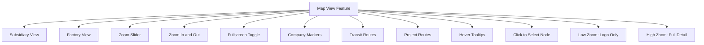

---

## Diagram 2: Filters Feature

**Title: War Room - Filters Feature**

Filters narrow the map and panel data by multiple criteria.

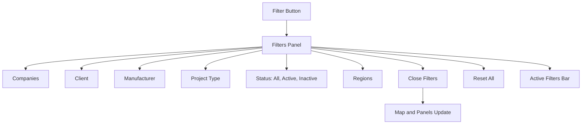

---

## Diagram 3: Command Menu Feature

**Title: War Room - Command Menu Feature**

The floating action button provides quick access to six common actions.

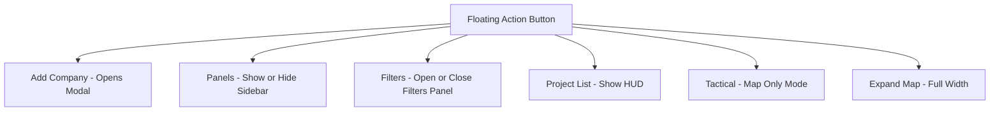

---

## Diagram 4: Sidebar Panels Feature

**Title: War Room - Sidebar Panels Feature**

The sidebar has two tabs and can be toggled on or off.

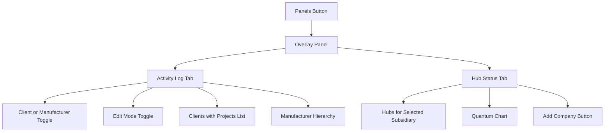

---

## Diagram 5: Clients Panel Feature

**Title: War Room - Clients Panel Feature**

Shows clients with projects. Edit Mode allows changing project status.

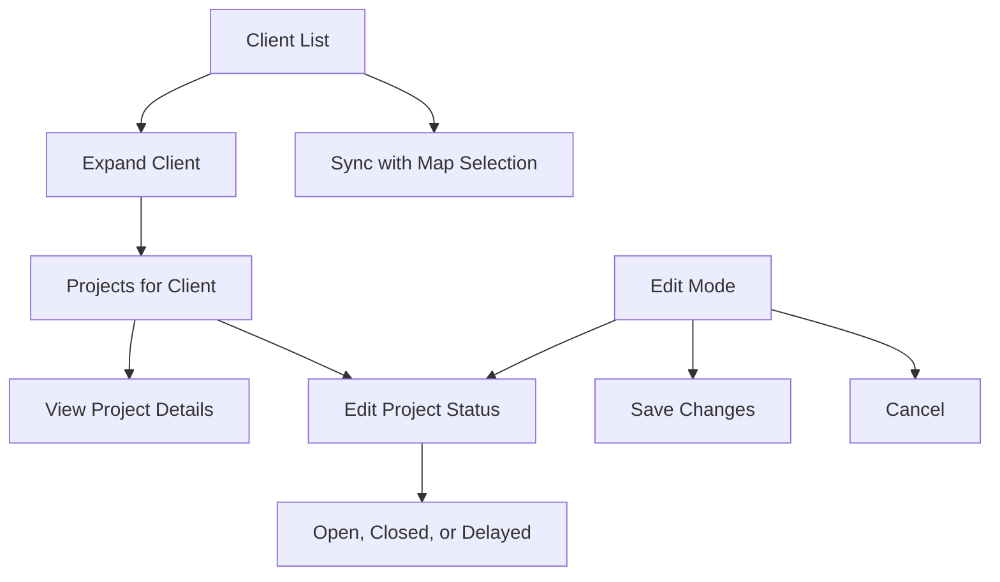

---

## Diagram 6: Activity Log Manufacturer View

**Title: War Room - Activity Log Manufacturer View**

Parent Groups to Subsidiaries to Factories hierarchy with edit and batch update support.

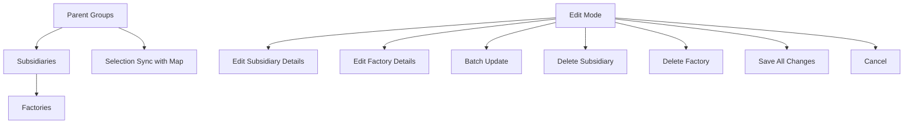

---

## Diagram 7: Add Company Feature

**Title: War Room - Add Company Feature**

Modal for adding new companies, optionally positioned over the map.

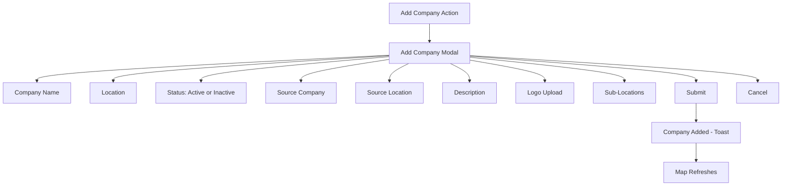

---

## Diagram 8: Context Panel Feature

**Title: War Room - Context Panel Feature**

Shows details when a map node or project is selected.

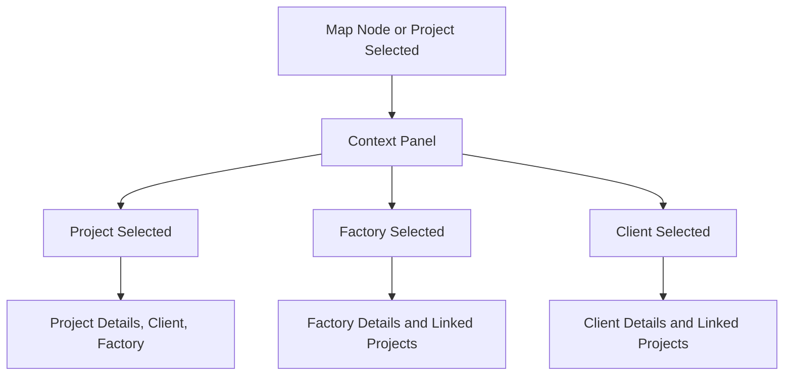

---

## Diagram 9: Project List HUD Feature

**Title: War Room - Project List HUD Feature**

Floating project list filtered by active map filters.

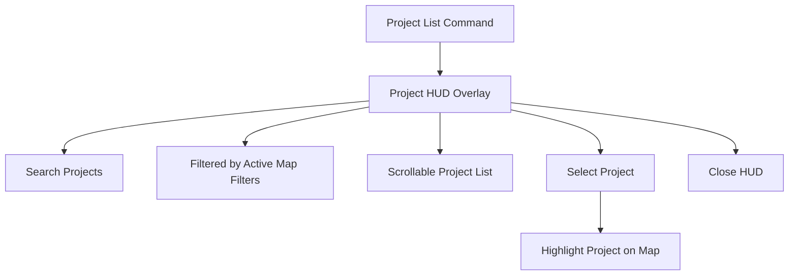

---

## Diagram 10: Tactical Mode Feature

**Title: War Room - Tactical Mode Feature**

Map-only focused view for presentations.

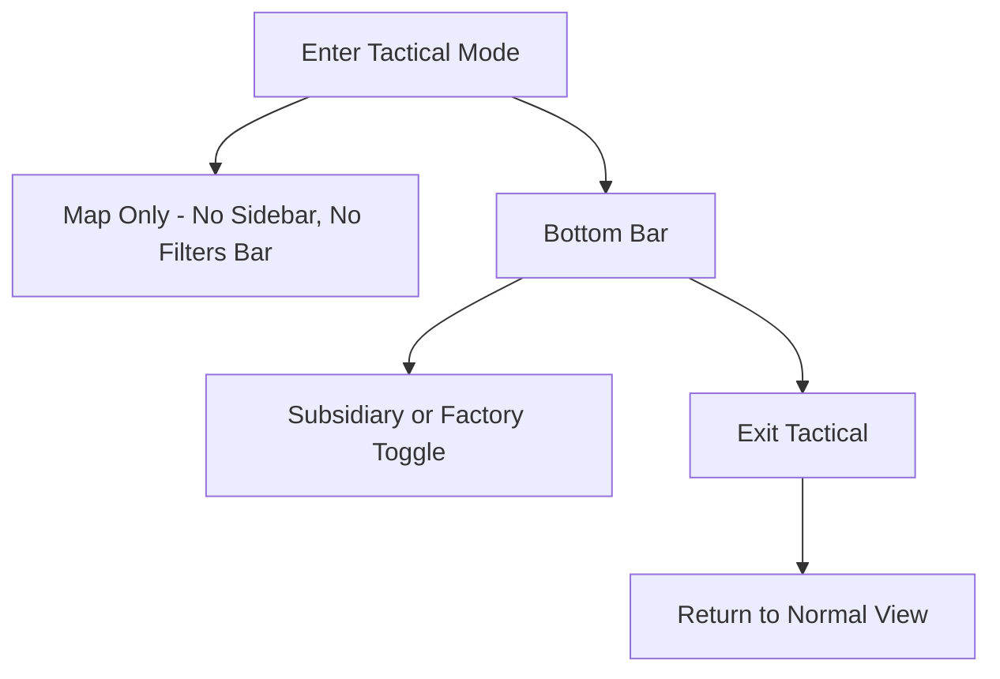

---

## Diagram 11: Hub Status Feature

**Title: War Room - Hub Status Feature**

Shows hub status for the selected subsidiary.

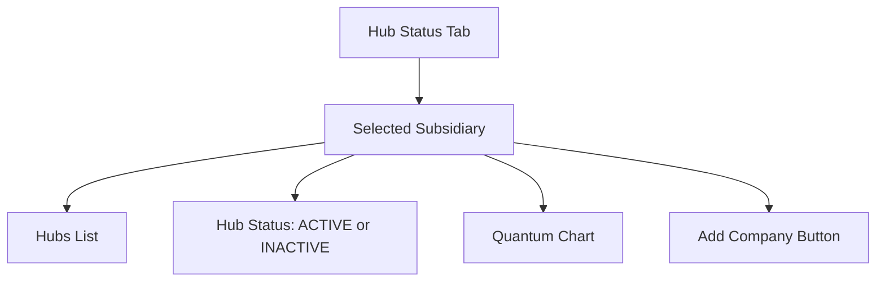

---

## Diagram 12: OVERVIEW - All War Room Features

**Title: War Room - Complete Feature Overview**

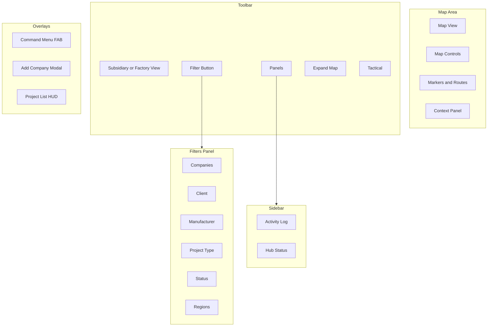

---

## How to Use

1. **Render in GitHub or Notion** – Paste the Mermaid blocks into any Markdown viewer that supports Mermaid.
2. **Export as images** – Use [Mermaid Live Editor](https://mermaid.live) to export each diagram as PNG or SVG.
3. **Share as slides** – Create a presentation with one diagram per slide.
